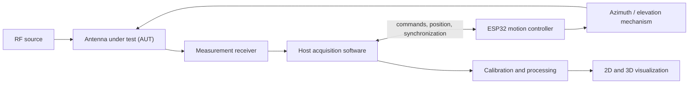

# Radiance3D

> **Visualize the invisible.**

Open-source hardware and software for automated 3D antenna radiation-pattern
measurement and visualization.

> [!IMPORTANT]
> **Early development — architecture and prototyping phase.** Radiance3D is not
> yet validated as laboratory-grade measurement equipment. Measurement accuracy
> has not been established, and the project is not a substitute for certified RF
> test equipment.

## Overview

Radiance3D is a planned, affordable platform for coordinating antenna positioning,
RF measurements, dataset processing, and radiation-pattern visualization. The
repository begins with documented boundaries, a versioned scan format, validation
tools, and simulator-friendly firmware interfaces so physical claims can be added
only after evidence exists.

## Why the project exists

Full 3D antenna characterization is often inaccessible outside specialized labs.
Radiance3D aims to make repeatable experimentation easier to study and reproduce
without presenting unvalidated measurements as calibrated results.

## Planned capabilities

- Motorized azimuth and elevation positioning
- Synchronized position and receiver samples
- Versioned JSON and CSV-compatible data exchange
- Calibration and repeatability workflows
- Polar plots and interactive 3D visualization
- Beamwidth, front-to-back ratio, side-lobe, and dataset comparison tools

These are roadmap targets, not completed features.

## System concept



Motion control and RF acquisition are separate interfaces. The host application is
intended to coordinate them and store each angle/value pair as one sample.

## Repository structure

| Path | Purpose |
| --- | --- |
| `firmware/` | ESP32 motion-control protocol and simulator-friendly foundation |
| `software/` | Python models, scan validation, and inspection CLI |
| `hardware/` | Provisional electronics and mechanical architecture |
| `data/` | Versioned schemas and clearly labeled simulated examples |
| `docs/` | Architecture, formats, experiments, and development guidance |
| `tools/`, `scripts/` | Conversion, validation, and repository checks |
| `assets/` | Reserved, documented locations for future project media |

See the [repository layout](docs/development/repository-layout.md) for details.

## Current project status

Stage 0 establishes terminology, architecture, schemas, contribution standards,
and automated checks. No physical scanner, receiver integration, measurement
accuracy, calibrated antenna gain, or production-ready workflow is claimed.
Example datasets may be simulated and are labeled in their metadata.

## Getting started

The initial useful workflow validates or summarizes scan files:

```bash
cd software
python3.11 -m venv .venv
source .venv/bin/activate
python -m pip install -e ".[dev]"
radiance3d validate ../data/examples/simulated/dipole-like-scan.json
radiance3d inspect ../data/examples/simulated/dipole-like-scan.json
```

For the full development setup, see [docs/development/setup.md](docs/development/setup.md).

## Documentation

Start at the [documentation index](docs/index.md), then review the
[architecture overview](docs/architecture/overview.md), [scan file
format](docs/software/file-formats.md), and [roadmap](ROADMAP.md).

## Contributing

Contributions are welcome at this early stage, especially design review, schema
feedback, and simulator tests. Read [CONTRIBUTING.md](CONTRIBUTING.md) before
opening a change.

## Roadmap

Development is staged from repository foundation through validation and a public
hardware release. See [ROADMAP.md](ROADMAP.md) for entry and exit criteria.

## Safety

RF transmissions must comply with all applicable laws, licensing requirements,
power limits, and local regulations. Motion systems can pinch, entangle, or move
unexpectedly; prototypes need accessible power isolation, conservative limits,
and supervision. See [SECURITY.md](SECURITY.md) for vulnerability reporting.

## License

Software and documentation in this repository are licensed under the
[MIT License](LICENSE). Future hardware design files may use a separate
open-hardware license when verified design files are actually published.

## Citation

Citation metadata is available in [CITATION.cff](CITATION.cff). Until a versioned
release exists, cite the repository URL and the commit used.
