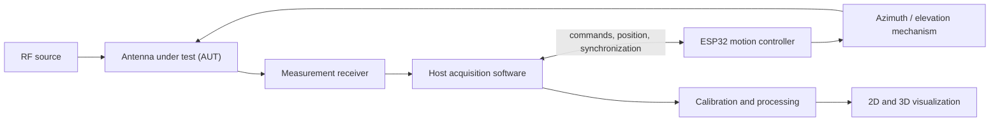

# Radiance3D

> **Visualize the invisible.**

Hardware and software for automated 3D antenna radiation-pattern measurement and
visualization, developed in the open. See [LICENSE](LICENSE) for terms.

> [!IMPORTANT]
> Radiance3D is being built in my house right now, and it is genuinely easy to make —
> anyone can do it. It shows how simple visualizing RF waves can be. It is built on
> first-principles physics, and laboratory-grade accuracy is the goal. That claim has
> to be earned rather than assumed: it needs the calibration, repeatability and
> uncertainty work in Stage 6. Until then Radiance3D has not been validated as
> laboratory-grade measurement equipment, and simulated or provisional results must
> not be presented as calibrated physical measurements.

## Overview

Radiance3D is a planned, affordable platform for coordinating antenna positioning,
RF measurements, dataset processing, and radiation-pattern visualization. The
repository begins with documented boundaries, a versioned scan format, validation
tools, and simulator-friendly firmware interfaces so physical claims can be added
only after evidence exists.

The current Version 1 baseline is an ESP32 development board with ESP-WROOM-32,
USB serial, two BIGTREETECH TMC2209 V1.3 drivers, two YEJMKJ/LYLANMO NEMA 17
bipolar motors, a standalone 12 V battery power system, and 5.0 V logic power from
an LM2596 buck converter. The exact board revision, carrier pinout, UART wiring,
R10 setting, sense resistor value, and mechanical validation remain pending.

Physical dimensions of the ESP32 board, both TMC2209 drivers and both NEMA 17 motors
have been measured with calipers and are recorded in
[`Measurements/`](Measurements/README.md), which is the canonical source for every
dimension in the project.

## Why the project exists

Full 3D antenna characterization is often inaccessible outside specialized labs.
Radiance3D aims to make repeatable experimentation easier to study and reproduce
without presenting unvalidated measurements as calibrated results.

## Planned capabilities

- Motorized azimuth and elevation positioning
- Synchronized position and receiver samples
- Versioned JSON and CSV-compatible data exchange
- Calibration and repeatability workflows
- Polar plots and interactive 3D visualization
- Beamwidth, front-to-back ratio, side-lobe, and dataset comparison tools

These are roadmap targets, not completed features.

## System concept



Motion control and RF acquisition are separate interfaces. The host application is
intended to coordinate them and store each angle/value pair as one sample.

## Repository structure

| Path | Purpose |
| --- | --- |
| `Measurements/` | Canonical physical dimensions, source photographs, and the Fusion 360 handoff |
| `firmware/` | ESP32 motion-control protocol and simulator-friendly foundation |
| `software/` | Python models, scan validation, and inspection CLI |
| `hardware/` | Provisional electronics and mechanical architecture |
| `data/` | Versioned schemas and clearly labeled simulated examples |
| `docs/` | Architecture, formats, experiments, and development guidance |
| `tools/`, `scripts/` | Conversion, validation, and repository checks |
| `assets/` | Reserved, documented locations for future project media |

See the [repository layout](docs/development/repository-layout.md) for details.

## Current project status

Implemented and passing its own tests:

- Native ESP-IDF firmware target
- Portable C++ controller simulator
- Python motion-controller client
- Versioned command and event protocol
- Dual-axis motion state machine
- Homing behavior
- Latched emergency stop
- Host-heartbeat timeout handling
- Driver diagnostics interfaces
- Portable firmware tests
- Python host-to-simulator integration tests

The simulator and physical firmware expose the same protocol, so command handling,
sequencing, response correlation, timeout behavior and recovery logic are all tested
before motor power is connected.

Stage 2 now implements the first physical motion-control layer: a compilable ESP32
target, two TMC2209 driver instances, non-blocking dual-axis stepping, two-pass homing,
latched emergency stop, diagnostics, command correlation, a serial host adapter, and
simulator parity. It is compiled and unit tested but has not yet been exercised on
connected hardware. No physical scanner motion, receiver integration, measurement
accuracy, calibrated antenna gain, or production-ready workflow is claimed. The
hardware baseline is now documented as the confirmed Version 1 family and the pending
validation items are explicit.

Mechanical design has not started. The measured dimensions and the Fusion 360 handoff
are prepared, but bearings, shaft couplers, fasteners, the antenna mount and the limit
switches are still unmeasured and block the pan-and-tilt design. See
[`Measurements/missing-measurements.md`](Measurements/missing-measurements.md).

## Getting started

The initial useful workflow validates or summarizes scan files:

```bash
cd software
python3.11 -m venv .venv
source .venv/bin/activate
python -m pip install -e ".[dev]"
radiance3d validate ../data/examples/simulated/dipole-like-scan.json
radiance3d inspect ../data/examples/simulated/dipole-like-scan.json
```

For the full development setup, see [docs/development/setup.md](docs/development/setup.md).

### Build and test the controller simulator

```bash
cd firmware/controller
cmake -S host -B build-host -DCMAKE_BUILD_TYPE=Release
cmake --build build-host
ctest --test-dir build-host --output-on-failure
```

### Run the host-to-simulator integration tests

```bash
cd software
source .venv/bin/activate

RADIANCE3D_SIMULATOR="$PWD/../firmware/controller/build-host/radiance3d-simulator" \
pytest -vv tests/test_firmware_simulator_protocol.py
```

### Build the ESP32 firmware

Radiance3D currently targets ESP-IDF v5.5.4.

```bash
source ~/esp/esp-idf/export.sh
cd firmware/controller
idf.py set-target esp32
idf.py build
idf.py size
```

Building firmware does not flash or power the physical motion system.

## Documentation

Start at the [documentation index](docs/index.md), then review the
[architecture overview](docs/architecture/overview.md), [scan file
format](docs/software/file-formats.md), [Version 1 engineering
baseline](docs/architecture/version-1.md), and [roadmap](ROADMAP.md).
For physical preparation, use the
[TMC2209 commissioning guide](docs/hardware/tmc2209-commissioning.md).

For physical dimensions and mechanical design, start at
[`Measurements/`](Measurements/README.md), then
[`fusion360-parameters.md`](Measurements/fusion360-parameters.md) and
[`fusion360-assistant-prompt.md`](Measurements/fusion360-assistant-prompt.md).

## Contributing

Contributions are welcome at this early stage, especially design review, schema
feedback, and simulator tests. Read [CONTRIBUTING.md](CONTRIBUTING.md) before
opening a change.

## Roadmap

Development is staged from repository foundation through validation and a public
hardware release. See [ROADMAP.md](ROADMAP.md) for entry and exit criteria.

## Safety

RF transmissions must comply with all applicable laws, licensing requirements,
power limits, and local regulations. Motion systems can pinch, entangle, or move
unexpectedly; prototypes need accessible power isolation, conservative limits,
and supervision. See [SECURITY.md](SECURITY.md) for vulnerability reporting.

## License

See [LICENSE](LICENSE) for the terms that apply to this repository. All rights are
reserved; this is not an open-source licence, despite the project being developed in
the open. Contact the address in `LICENSE` for commercial licensing enquiries.

## Citation

Citation metadata is available in [CITATION.cff](CITATION.cff). Until a versioned
release exists, cite the repository URL and the commit used.
