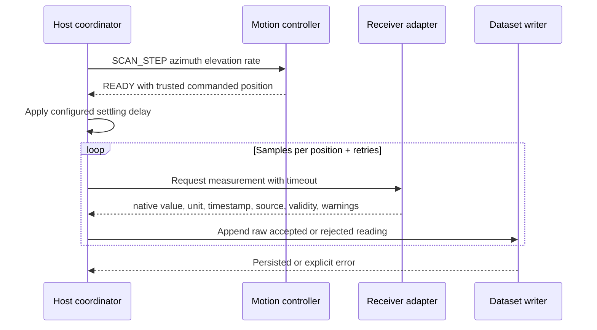

# Data flow

One planned measurement sample moves through the system as follows:

The controller's `READY` response is a synchronization boundary in the simulator, not
proof that a physical axis has settled. A physical implementation may need encoder
feedback, dwell time, vibration criteria, and receiver settling. The host must record
the controller's position kind; Version 1 reports commanded/open-loop position.

Write failures must stop or pause a scan rather than allow unrecorded measurements.
