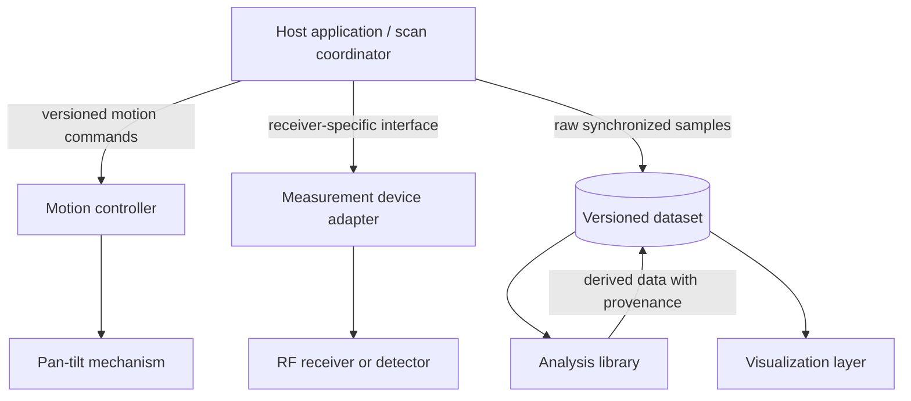

# Architecture overview

Radiance3D separates motion, measurement, coordination, analysis, visualization, and
storage so a receiver or motion mechanism can change without redefining the entire
system.

## Component responsibilities

- **Motion controller:** Owns axis state, homing, limits, stop behavior, position
  reports, and motion faults. It does not interpret RF values.
- **Measurement device:** Produces a timestamped value with an explicit unit and
  device metadata. It does not control motion.
- **Host application:** Coordinates requested angles and measurement timing, records
  warnings, and persists raw samples.
- **Analysis library:** Performs explicit, testable transformations without mutating
  raw data.
- **Visualization layer:** Presents stored data and must expose missing, interpolated,
  clipped, or otherwise qualified samples.
- **Dataset format:** Preserves configuration, provenance, units, timestamps, and
  data kind independently of any specific receiver.

Only the schema, dependency-free scan validation, and motion-protocol simulator exist
at this stage. The [Version 1 engineering baseline](version-1.md) defines the complete
hardware, motion, synchronization, and data architecture that these interfaces serve.
