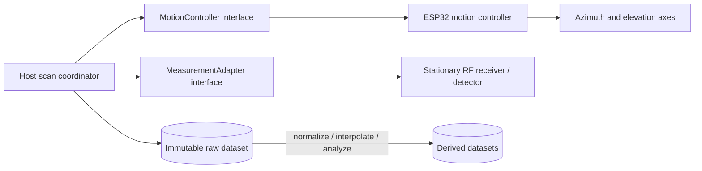

# Version 1 engineering baseline

This page is the current Version 1 architecture. Values called **provisional** must
remain configurable and must not be presented as verified hardware performance.
Version 1 is an affordable, repeatable experimental platform, not laboratory or
certified antenna-test equipment.

## System partition



The ESP32 owns motion planning, open-loop step counting, homing, configured limits,
scan-step execution, and host communication. It does not acquire, interpret, analyze,
or visualize RF data. The host coordinates motion and an interchangeable measurement
adapter. No Version 1 interface assumes RX5808, SDR, spectrum-analyzer, power-detector,
NanoVNA-derived, or custom-detector semantics.

USB serial is the Version 1 transport. Wi-Fi and Bluetooth are out of scope, but
transport details stay outside the public motion API so a future transport can carry
the same versioned protocol.

## Coordinate convention

All public configuration, protocol, scan planning, and stored positions use degrees:

- Azimuth `0°` is forward, `90°` right, `180°` rear, and `270°` left.
- Elevation `0°` is the horizon, `+90°` straight up, and `-90°` straight down.

Radians may appear only inside a mathematical utility. An imported dataset with a
different convention must be transformed explicitly and recorded as derived data.
Initial conceptual travel is azimuth `0°` through `360°` and elevation `-90°` through
`+90°`; actual configured limits govern every move. Azimuth is not continuous or
unlimited in Version 1.

## Version 1 hardware assumptions

- One ESP32 development board using 3.3 V logic.
- Two NEMA 17 bipolar steppers, provisionally assumed to be 1.8° full-step unless
  configuration says otherwise.
- One replaceable stepper-driver implementation per axis. TMC2209 with UART
  configuration, ESP32-controlled STEP/DIR, and firmware-controlled enable is the
  Version 1 target, but no public motion behavior depends on it.
- One configurable home switch per axis and one emergency-stop input.
- One 12 V DC input, with motor drivers on 12 V and an appropriate regulated buck
  converter feeding the ESP32 by its board-supported input method.

Exact motor current, holding torque, winding resistance, pulley ratio, gear ratio,
belt pitch, supply-current rating, board pinout, and printed dimensions are not yet
selected. They must not be hardcoded or inferred from these assumptions.

## Motion configuration and position confidence

Each axis configuration contains motor full steps per revolution, microsteps, gear
ratio, direction inversion, home offset, minimum and maximum angle, maximum speed,
acceleration, and homing behavior. The commanded increment is calculated as:

```text
steps per output revolution = motor full steps × microsteps × gear ratio
commanded step angle = 360° / steps per output revolution
```

These calculations describe command quantization only:

- **Commanded angular resolution** is the smallest representable request.
- **Motor step resolution** follows the full-step and microstep configuration.
- **Mechanical resolution** includes transmission geometry, stiffness, and backlash.
- **Repeatability** is the observed spread when returning to a position.
- **Absolute accuracy** is error relative to a traceable angular reference.

Microstepping alone does not demonstrate 0.1° mechanical resolution or accuracy.
Version 1 targets 0.1° commanded resolution, while repeatability is prioritized over
speed and requires measurement before any performance claim. Velocity and acceleration
are configurable; backlash compensation is a future transformation at the motion
planning boundary.

Position is open-loop commanded position. It becomes trusted only after successful
homing. Reset, motion fault, emergency stop, driver disable, motion timeout, or
suspected missed steps invalidates confidence and requires re-homing. The public host
API can later report encoder-backed observations without changing scan coordination.

## Homing and safety behavior

Version 1 configuration supports normally-open or normally-closed switch logic,
debounce duration, homing direction and speed, back-off distance, and a second slow
approach. Normally-closed wiring is recommended because a broken wire can be detected,
but logic remains configurable.

Every move is checked against software travel limits and a motion timeout. Emergency
stop is a dedicated input and invalidates position; clearing a fault never restores
position confidence. A home switch establishes a repeatable reference, not continuous
absolute position after missed steps. Firmware controls driver enable, but a supervised
prototype also needs accessible power isolation that does not depend on firmware.

## Mechanical and RF geometry

The AUT rotates while the RF source or measurement reference and receiver remain
stationary. This reduces receiver/feedline movement, cable strain, and position-linked
RF variation; it also keeps a future slip-ring option at the rotating fixture boundary.
It does not eliminate cable effects. Restricted azimuth travel, row reversal, planned
cable unwinding, and eventually a validated slip ring may be needed.

Record fixed separation distance, antenna height, polarization, line of sight,
surroundings, support material, RF-source stability, coax routing, and whether
far-field distance was sufficient for the experiment. Keep conductive structure and
nearby reflections low where practical. Do not label results as true gain without an
appropriate documented reference calibration.

## Raster scan synchronization

Version 1 uses an elevation-major raster. Alternate azimuth rows may reverse direction
to reduce cable travel. The planner includes both configured endpoints and refuses any
point outside machine limits.

At every point the host:

1. moves to the commanded azimuth/elevation;
2. waits for a trusted motion-complete response;
3. waits the configured settling delay;
4. requests one or more native RF readings;
5. validates each reading and applies the configured retry policy;
6. stores every accepted and rejected raw reading with sequence and source; and
7. computes an optional mean or median only as an additional result or derived dataset.

Settling time, samples per position, averaging method, rejected-reading treatment,
measurement timeout, and retry count are scan configuration. A simulator `READY`
acknowledgement is a synchronization boundary, not proof of physical settling.

## Dataset and processing contract

Each new scan uses schema `1.1.0` and records a unique ID, zoned timestamp, software,
firmware, protocol and hardware revisions, AUT and device metadata, frequency,
commanded step sizes, native units, calibration status, operator/environmental notes,
warnings, provenance, and samples. Each sample records azimuth, elevation, native
value/unit, timestamp, measurement source, commanded/observed position kind, validity,
and a contiguous sequence number.

Raw data is immutable. Normalization, calibration, interpolation, coordinate
conversion, visualization preparation, and export produce derived artifacts that
reference source dataset IDs and name their method. Arbitrary receiver output must
not be converted to dBm without a documented calibration model.

## Explicit Version 1 exclusions

Version 1 does not require a custom PCB, GUI or Android application, wireless or cloud
operation, automatic gain calibration, continuous azimuth rotation, encoder feedback,
real-time 3D rendering, simultaneous multi-frequency scanning, or physical support for
any RF device. Interfaces and provenance support those later developments without
claiming them now.
